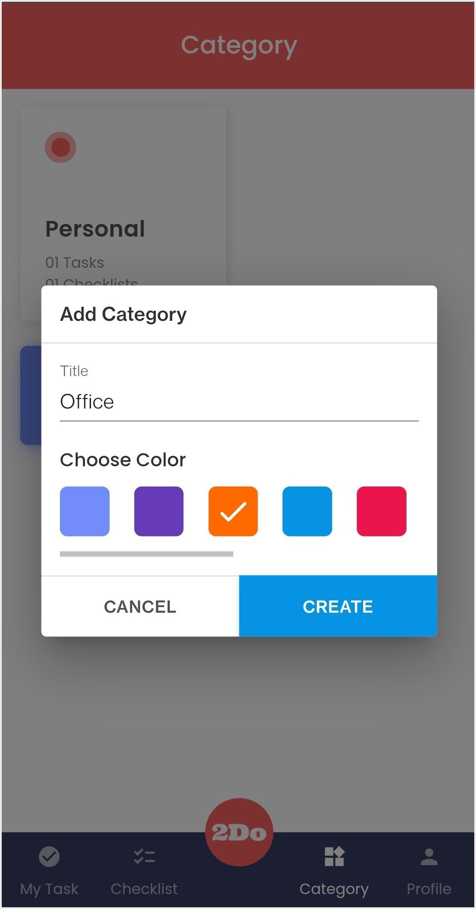
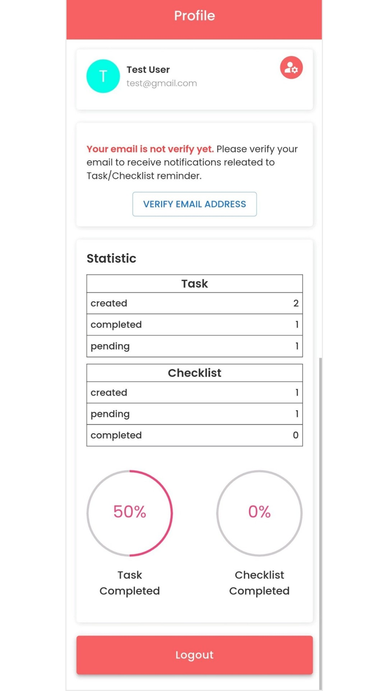
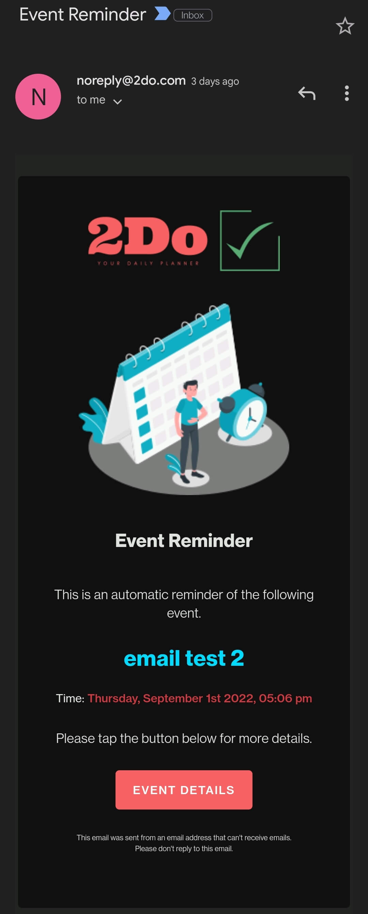
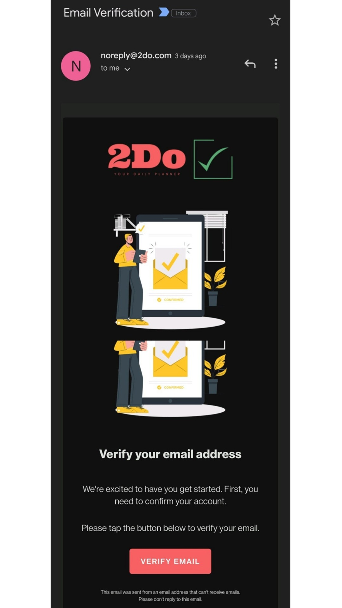

# MERN 2Do App

### <h2 align="center"> ⚡️⚡️⚡️ &nbsp; [APP LINK](https://mern-2do.herokuapp.com/login) ⚡️⚡️⚡️ </h2>

# Features

- Login  
- Create Tasks & Checklists  
- Create multiple Categories  
- Event Reminder  
- Statistic Report
- FilterBy options

# Screenshots:

           

## Installation

1. Clone the repository
2. Install the application: `npm install` for both client and server
3. In server/2do create .env file add and config the all the details. You can refer .env.example file.
4. Create list of cardColors for your app and add one of the cardColor ID in server\2do\src\services\category.service.js line no. 11 for cardColor: <CARD COLOR ID>
5. To run Server - yarn dev
6. To run Client - npm start
