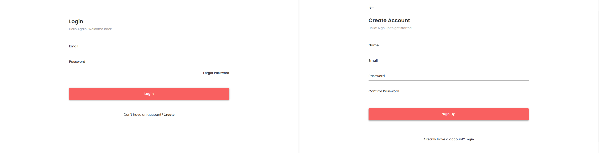
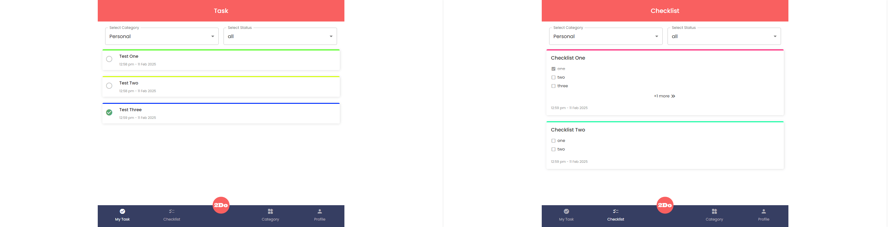
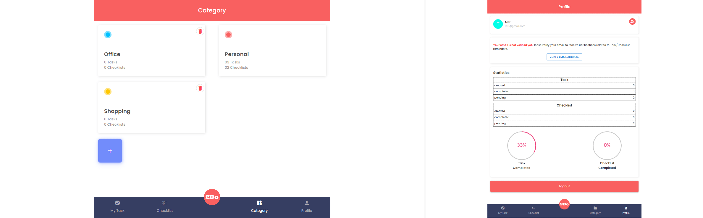
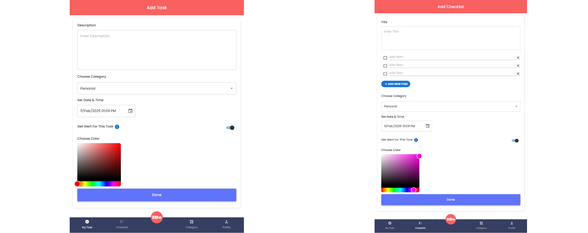
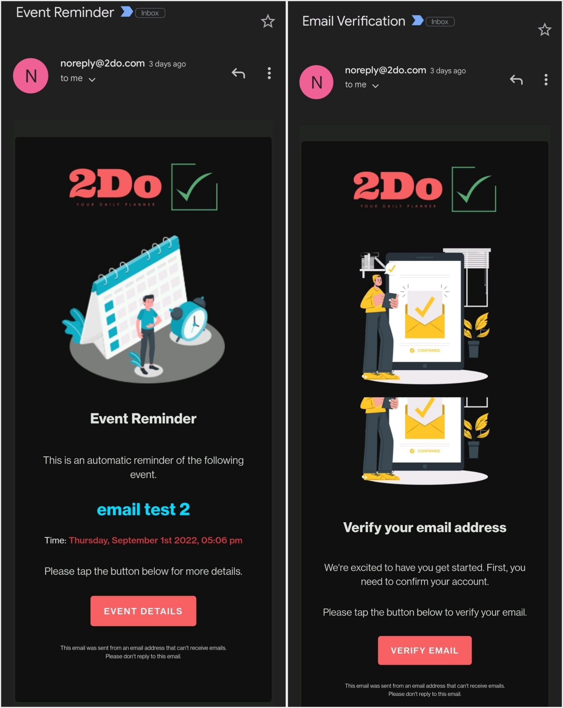

# MERN 2Do App

### <h2 align="center"> ⚡️⚡️⚡️ &nbsp; [APP LINK](http://2do-app-frontend.s3-website.ap-south-1.amazonaws.com/login) ⚡️⚡️⚡️ </h2>

### **Credentials:**

```bash
email: test@gmail.com
password: test@123
```

## **Features**

- **User Authentication:** Secure login functionality.
- **Task Management:** Create, edit, and delete tasks and checklists.
- **Category Organization:** Create multiple categories to categorize your tasks.
- **Event Reminders:** Set reminders for important tasks.
- **Statistical Reports:** Generate reports for task statistics.
- **Filtering Options:** Filter tasks based on various criteria.

## **Screenshots**







## **Installation**

### **Clone the Repository**

1. Clone the repository to your local machine.

### **Run Client (React.js) Locally**

2. Navigate to the project directory:
   ```sh
   cd 2Do/client
   ```
3. Install dependencies:
   ```sh
   npm install
   ```
4. Start the development server:
   ```sh
   npm run start
   ```
5. The client will be available at:  
   [http://localhost:3001](http://localhost:3001)

### **Run Server (Node.js) Locally**

6. Create a `.env` file by referring to `.env.example` and add the necessary configurations like MONGODB, REDIS (upstash), SMPT (Gmail) etc.
7. Install dependencies:

   ```sh
   npm install
   ```

8. Once configuration is done:
   ```sh
   npm run watch
   ```
9. The server will be available at:  
   [http://localhost:3000](http://localhost:3000)
